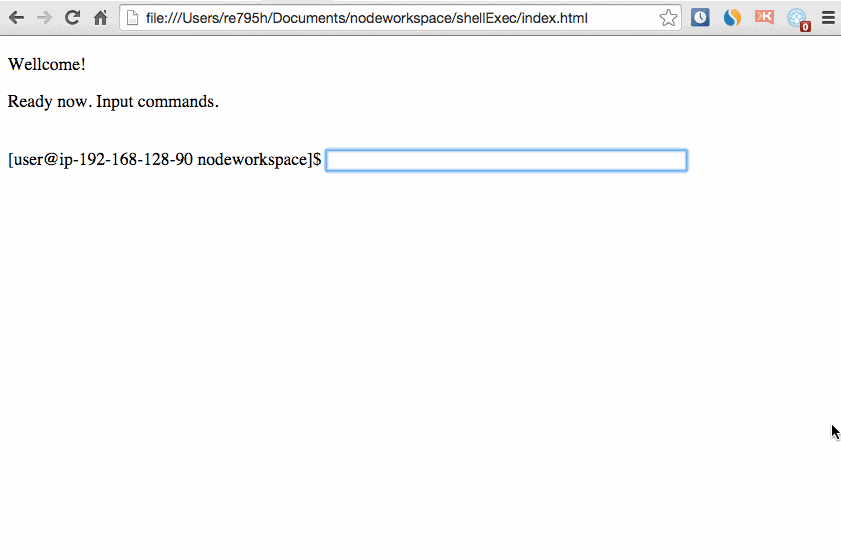

# CUI-like-browser

## Description
Create CUI like tool on web brower. You can access and operate remote server using http, not ssh.
This program can recode access.log automatically.

## Demo

## Usage
##### Step1
Put server.js on a remote server and stand up node server program. 

##### Step2
Keep runnning the node server, and opne the port (default is 8081)

##### Step3
Put index.html and script.js on a client and access

## Licence
[MIT](https://github.com/tcnksm/tool/blob/master/LICENCE)

## Author
[takayuki-tamura](https://github.com/takayuki-tamura)
